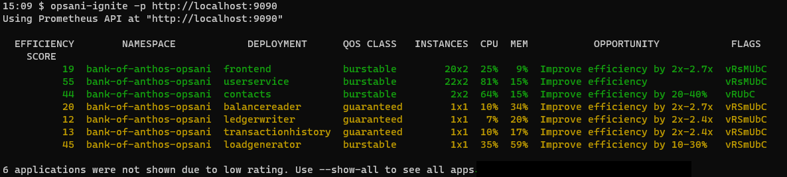

# Opsani Ignite for Kubernetes

Opsani Ignite analyzes all applications running on a Kubernetes cluster 
and identifies the opportunities for optimization.

CAUTION: Opsani Ignite is a new tool, still in alpha testing. We appreciate feedback and suggestions.

# Install

To install `opsani-ignite` download the binary for your OS (Darwin for MacOS; Windows or Linux) from the [latest release](https://github.com/opsani/opsani-ignite/releases/latest). Check often as updated analysis capabilities are released frequently; if your version is more than a week old, please check if a newer version is available before using it.

# Run Ignite

To run Opsani Ignite, you will first want to set up port forwarding to the Prometheus API on your cluster. A typical command looks like this:

`kubectl port-forward service/prometheus-server 9090:80 -n prometheus`

Once port forwarding is active, run the `opsani-ignite` executable, providing the URL to the port-forwarded Prometheus API:

`opsani-ignite -p http://localhost:9090`

Opsani Ignite displays the list of services with optimization opportunity:

# Troubleshooting 

Opsani Ignite records diagnostic information in `opsani-ignite.log`. You can increase the logging level by adding the `--debug` option to the command line.

# Where To Get Help

You can reach out to Opsani Technical support at `support <at> opsani <dot> com` or, for faster service, use the chat bot on the [Opsani web site](www.opsani.com).
